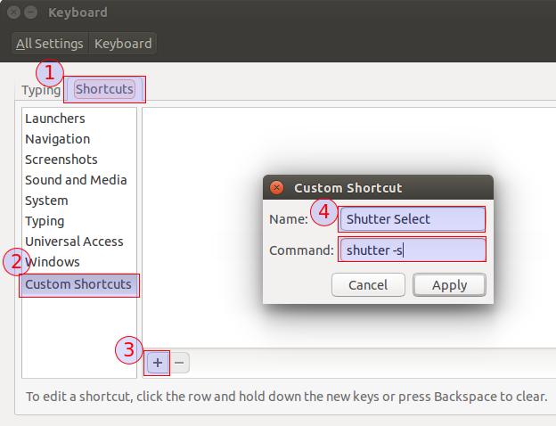
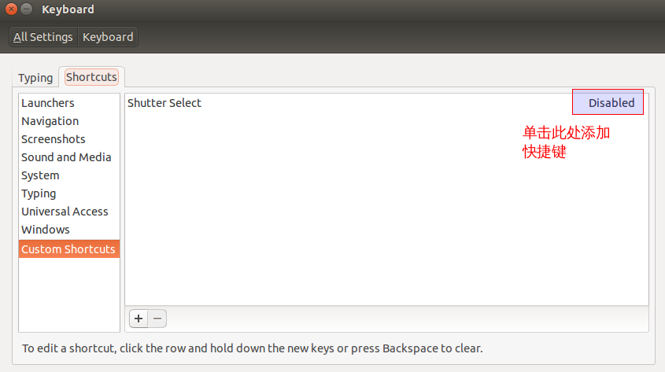

# ubuntu装机软件教程

## 一、ubuntu自身配置

0.设置启动项的 ```nomodeset```，以保证系统可以正常运行

1.设置源为清华源

2.调整系统语言，首先进入语言，调整汉语最前，应用系统语言，登出，进入后选择不再提示，保持旧的语言格式，使得文件目录是英文的，再次打开语言，选择fcitx，登出重新进入，配置切换语言的格式

3.安装Nvidia的显卡

1）将Nvidia的驱动移动到home下面

```
	sudo mv NVIDIA-Linux-x86_64-450.57.run /home/
```

2)  将卸载旧版本的英伟达显卡驱动，打开terminal

```
	sudo apt-get purge nvidia*
```

3）禁用系统自带的 nouveau 驱动：

（1）打开编辑配置文件：

```
	sudo gedit /etc/modprobe.d/blacklist.conf
```

（2）在最后一行添加：

```
	blacklist nouveau
```

​	这一条的含义是禁用**nouveau**第三方驱动，之后也不需要改回来。由于nouveau是构建在内核中的，所以要执行下面命令生效:

```
	sudo update-initramfs -u	
```

（6）重启

```
	reboot
```

​			重启之后，可以查看nouveau有没有运行

```
	lsmod | grep nouveau  # 没输出代表禁用生效
```

 （7） 停止可视化桌面

​		为了安装新的**Nvidia**驱动程序，我们需要停止当前的显示服务器。最简单的方法是使用**telinit**命令更改为运行级别**3**。执行以下**linux**命令后，显示服务器将停止，因此请确保在继续之前保存所有当前工作（如果有）：

```
	sudo telinit 3
```

​		之后会进入一个新的命令行会话，使用当前的用户名密码登录

（8）安装驱动

​		给驱动文件增加可执行权限：

```
	sudo chmod a+x NVIDIA-Linux-x86_64-450.57.run
```

​		然后执行安装：

```
	sudo ./NVIDIA-Linux-x86_64-390.48.run --no-opengl-files –no-x-check –no-nouveau-check
```

（9）常见问题解决

1. 安装完驱动后，HDMI扩展屏幕不能使用，现象表现为能识别扩展屏幕但是黑屏。
   这种情况需要确定以下内容是否已经设置：

   - bios内是否已经禁止安全启动、快速启动。
   - linux系统是否设置了禁止nouveau

   如果上面的都已经做了，但还是有问题，可以尝试下面的配置：

   ```shell
   sudo nano /usr/share/X11/xorg.conf.d/10-amdgpu.conf
   ```

   > 有可能不是这个文件，但是类似。

   修改为下面这样

   ```
   Section "OutputClass"
      Identifier "AMDgpu"
      MatchDriver "amdgpu"
      Driver "amdgpu"
      Option "PrimaryGPU" "no"
   EndSection
   ```

   下面修改nvidia的配置

   ```shell
   sudo nano /usr/share/X11/xorg.conf.d/10-nvidia.conf
   ```

   修改为下面这样：

   ```
   Section "OutputClass"
      Identifier "nvidia"
      MatchDriver "nvidia-drm"
      Driver "nvidia"
      Option "AllowEmptyInitialConfiguration"
      Option "PrimaryGPU" "yes"
      ModulePath "/usr/lib/x86_64-linux-gnu/nvidia/xorg"
   EndSection
   ```
   

然后重新启动。

到此NVIDIA的安装方式讲解完了。

4.安装 wifi驱动

1）移动firmware

```
	sudo mv firmware /lib/
```

2) 安装wifi的驱动后，重启

```
	sudo apt-get install linux-generic-lts-wily
	sudo add-apt-repository ppa:canonical-hwe-team/backport-iwlwifi
	sudo apt-get update
	sudo apt-get install linux-generic-lts-wily
```

5.卸载系统软件
   1）卸载火狐浏览器

```
	dpkg --get-selections |grep firefox
	sudo apt-get purge firefox firefox-locale-en firefox-locale-zh-hans unity-	scope-firefoxbookmarks 
```

  2） 卸载亚马逊

```
	sudo apt-get remove unity-webapps-common
```

  3） 卸载自带的Word

```
	sudo apt-get remove --purge libreoffice
```

6.安装福昕PDF阅读器

```
	tar -zxvf FoxitReader.enu.setup.2.4.4.0911.x64.run.tar.gz 
	sudo ./FoxitReader.enu.setup.2.4.4.0911\(r057d814\).x64.run 
```

7.安装谷歌浏览器

```
	sudo dpkg -i google-chrome-stable_current_amd64.deb
```

8.安装Visual Studio Code

```
	sudo dpkg -i code_1.41.0-1576089540_amd64.deb
```

9.安装WPS和字体 

```
	sudo dpkg -i wps-office_11.1.0.8392_amd64.deb
```

1）安装WPS的字体

```
	unzip wps_symbol_fonts.zip
	sudo cp mtextra.ttf  symbol.ttf  WEBDINGS.TTF  wingding.ttf  WINGDNG2.ttf  WINGDNG3.ttf  /usr/share/fonts
```

8.安装MarkDown-typora
       

```
	sudo apt-key adv --keyserver keyserver.ubuntu.com --recv-keys BA300B7755AFCFAE
	sudo add-apt-repository 'deb http://typora.io linux/'
	sudo apt-get update
	sudo apt-get install typora
```

10.生成ssh，并添加到github中

```
	ssh-keygen -t rsa -C "lizw_0304@163.com"
	cat ~/.ssh/id_rsa.pub
```

11.安装微信

###### 1) 解压缩 linux-x64.tar.gz

```
	tar -zxvf linux-x64.tar.gz
```

###### 2) 将微信添加到启动器

```
	sudo mv electronic-wechat-linux-x64/ /home/opt/
```

3) 将 electronnic-wechat 打开，锁定在任务栏

12.安装网易云音乐

```
	sudo dpkg -i netease-cloud-music_1.0.0_amd64_ubuntu16.04.deb
```

如果发生错误，你可以执行下面的指令：

```
	sudo apt-get -f install
```

执行之后，你可以继续执行上面的指令

```
	sudo dpkg -i netease-cloud-music_1.0.0_amd64_ubuntu16.04.deb
```

13.修改ubuntu的主题

1）安装MacBuntu OS Y Theme,Icons and cursors

```
	sudo add-apt-repository ppa:noobslab/macbuntu
	sudo apt-get update
	sudo apt-get install macbuntu-os-icons-lts-v7
	sudo apt-get install macbuntu-os-ithemes-lts-v7
```

2）将Saved Pictures 移动到PIctures，修改桌面壁纸

```
	sudo mv Saved Pictures/ /Pictures/
```

3) 安装Tweak tool软件启用主题、图标等，设置ubuntu的主题，图标

```
	sudo apt-get install unity-tweak-tool
```

14.修改蓝牙设备的key，实现蓝牙设备在双系统的应用。

tips：楼主在实践中，发现华为的蓝牙鼠标居然有三个MAC地址，所以请大家注意在操作的过程中注意电脑MAC地址和蓝牙设备MAC地址的匹配，从而才能实现蓝牙设备的双系统实现。

具体操作轻参考链接：https://blog.csdn.net/10km/article/details/61201268

15.修改ubuntu启动项：

```
	sudo gedit /etc/default/grub
	打开后，修改启动的值 GRUB_DEFAULT=0
	执行 sudo update-grub
```

16.安装matlab_linux:

参考链接：https://www.cnblogs.com/taoyuyeit/p/8823311.html

17.时间同步

```
	sudo timedatectl set-local-rtc 1
```

18. 安装git

```
	git config --global user.email "lizw_0304@163.com"
    git config --global user.name "lizhiwei0304"
```

19.安装pycharm

```
	mv pycharm-2019.1.3/ /home/lizhiwei/opt
```

然后打开～/.bashrc

```
	gedit ~/.bashrc
```

20.安装截屏软件shutter

```
	sudo add-apt-repository ppa:shutter/ppa
	sudo apt-get update
	sudo apt-get install shutter
```

然后打开设置，设置开启的快捷键



添加成功的状态



单击右侧的禁用，然后快速按下Ctrl+Alt+A，如下图。然后利用Ctrl + Alt + A,测试OK.


# ps:

1. 里面的快捷键命令用：shutter -s 或者shutter –select

2. 截取当前活动窗口：shutter -a （a表示active）

3. 截取拖拉区域：shutter -s （s是select之意），拖拉出矩形区域后按Enter。

21.安装Kazam

```
	sudo apt-get install kazam
```

